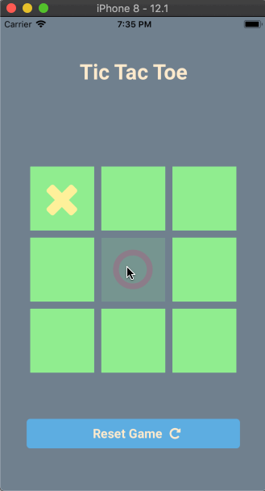

# Tic-Tac-Toe
Implementation of a Tic-Tac-Toe app using React Native and Expo.

## Video walk-through

## User stories 

- [x] Allow 2 players to play tic tac toe (Follow the rules of [Tic Tac Toe](https://en.wikipedia.org/wiki/Tic-tac-toe#Rules))
- [x] Have 3x3 grid on which the players can play
- [x] Recognize when a player has won and declare that player as victorious
- [x] Allow the user to start a new game
